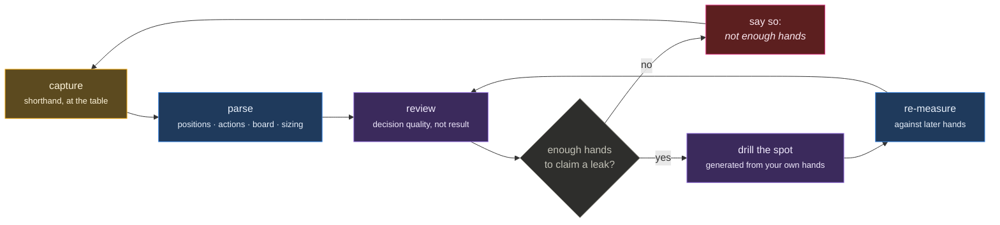

# Poker Study System

The working system behind a serious attempt to get good at live poker: fast hand capture,
tournament results tracking, and a review loop that is deliberately honest about variance.

_Public overview of a private project. Method and tooling only — no personal results._

## Shorthand capture

Hands are recorded in a compact shorthand designed to be typed from memory after a session
rather than reconstructed from a form:

```
2/5 · 800 eff · CO 3b 55 · BTN call · flop 5h7d9s
```

A parser turns that into structured hands — positions, actions, board, sizing — that the
rest of the system can query. The design bet is that a format you will actually use beats a
complete one you won't: an unlogged hand is worth nothing, so capture friction is the
binding constraint, not schema richness.

## Variance honesty

The core discipline, and the reason this exists rather than a spreadsheet:

- Results over a short sample are **not evidence of skill**, and the review refuses to
  present them as such. Sample sizes are shown next to every rate, and a rate that cannot
  be distinguished from noise says so in words.
- **Decision quality is tracked separately from outcome.** A hand is reviewed on what was
  known at the time; the result is metadata, not the grade.
- Leaks are only claimed when they show up across enough occurrences to mean something —
  the review will report "not enough hands to say" and that is treated as a real answer.

## The loop



The `not enough hands` branch is the point of the whole system. Most tracking software
draws a trend line through noise; this one is built to refuse.

Sessions and tournaments are logged with the conditions attached (stakes, structure,
table dynamics), so review can ask whether a pattern belongs to a spot or to a game type.
Study output feeds a drill list; the drill list is re-measured against later hands rather
than assumed fixed.

## The code

Nine files in [`code/`](code/), copied verbatim: the shorthand parser, the equity engine,
the push/fold and equity-matrix solvers, the postflop validator, and the test suite. See
[`code/README.md`](code/README.md).

## Tooling

- A hand-history corpus is used to test the parser against real-world formats rather than
  hand-written fixtures.
- Analysis tools for range work and spot frequencies, kept as small scripts on purpose —
  the system's value is the loop and the honesty rule, not the tooling.
- The capture front end is a phone app; results and study notes live as plain files that
  are diffable and greppable, so the history stays readable in ten years.

_Last updated August 2026._
